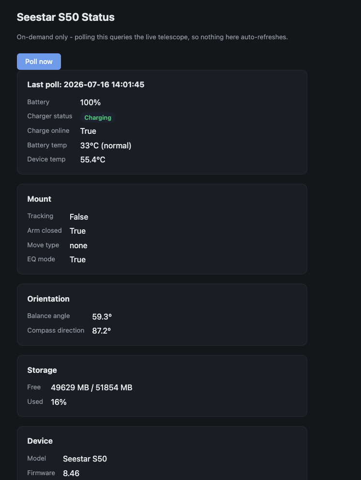

# Seestar S50 Battery Monitor

Real battery/power telemetry for the ZWO Seestar S50, read directly over its
own native protocol - the same one the official Seestar app uses internally.
This is **not** the Alpaca/ASCOM layer that NINA and other astronomy software
talk to, and that's the whole point: Alpaca has no battery data at all. This
project talks to the telescope the same way the official app does, so it can
show you battery percentage, charging status, internal temperature, and more.



It includes:
- A one-off command-line query tool
- A recurring background monitor that alerts you (Discord and/or Pushover)
  when the battery gets low
- A simple web dashboard you can check from any browser on your network

## Who this is for

You don't need to be a programmer to use this, but it does involve typing
commands into a Terminal window and editing a couple of text files. If
you've never used a command line before, expect to look a few things up
(like "how do I open Terminal on Mac") along the way - this guide assumes
you can copy/paste commands and edit a file, nothing more advanced than that.

## How it works (the short version)

The S50 speaks a message-based protocol over a plain network connection on
port 4700. Before it will hand over real data, it wants proof you're a
legitimate client - this is done with a private cryptographic key that's
built into the official Seestar app itself. This project reads that same
key from the app you already have installed, so it can "prove" itself the
same way the app does, then ask the telescope for its status.

If you want the full technical details of the handshake, see "Protocol
details" near the bottom of this file.

## Step 1: Find your Seestar app's private key file

This project needs a copy of a file that comes bundled with the official
Seestar app - it's not something you create or generate, it's already on
your computer if you have the app installed.

**On macOS**, if you're running the Seestar app via Apple's
iOS-app-compatibility feature on an Apple Silicon Mac, look here:

```
/Applications/Seestar.app/Wrapper/Seestar.app/my_private.pem
```

If your setup is different (a different OS, or the app installed
elsewhere), search for a file named `my_private.pem` inside wherever the
Seestar app is installed. On macOS, you can search from Terminal with:

```
find /Applications -name "my_private.pem" 2>/dev/null
```

**Important:** this file is a real credential (it's what lets you
authenticate to your own telescope). Don't upload it anywhere, don't commit
it to a public repository, and don't share it. This project is written so
it never needs to be copied into the project folder itself - you just tell
the config file where to find it.

## Step 2: Install

Open Terminal, navigate to this folder, and run:

```
python3 -m venv .venv
.venv/bin/pip install -r requirements.txt
```

This creates an isolated Python environment (a "venv") inside this folder
and installs the couple of packages this project needs, without affecting
any other Python software on your computer.

Then copy the example config file and edit it with your own values:

```
cp config.example.json config.json
```

Open `config.json` in any text editor and fill in:

| Field | What it is |
|---|---|
| `seestar_host` | The Seestar's own network address - usually `10.0.0.1`, that's the default and you likely don't need to change it |
| `private_key_path` | The full path to `my_private.pem` you found in Step 1 |
| `low_battery_threshold` | Battery percentage that triggers an alert (e.g. `75` alerts any time the battery is below 75%) |
| `discord_webhook_url` | (Optional) A Discord webhook URL, if you want alerts posted to a Discord channel - see [Discord's webhook guide](https://support.discord.com/hc/en-us/articles/228383668) if you don't already have one |

`config.json` is never committed to this repository (it's in `.gitignore`)
since it holds your personal setup and file paths.

### Optional: Pushover alerts

If you'd also like a push notification to your phone (in addition to, or
instead of, Discord), sign up for a free [Pushover](https://pushover.net/)
account, then add these two lines to a file called `.env` in your home
directory (create the file if it doesn't exist):

```
PUSHOVER_TOKEN=your_app_token_here
PUSHOVER_USER=your_user_key_here
```

If these aren't set, Pushover alerts are just silently skipped - Discord
alone works fine too.

## Step 3: Try it

A one-off check, printed straight to your Terminal:

```
.venv/bin/python3 seestar-battery-query.py /path/to/my_private.pem
```

(Replace the path with wherever you found `my_private.pem` in Step 1.) If
everything's set up right, you'll see a big block of information about your
telescope, including a `pi_status` section near the end with your actual
battery percentage and charging status.

## The three tools in this project

### 1. `seestar-battery-query.py` - one-off check

Run it any time you just want to see the current status printed to your
screen. Good for a quick manual check, or for testing that everything's
configured correctly.

```
.venv/bin/python3 seestar-battery-query.py /path/to/my_private.pem
```

### 2. `monitor.py` - recurring background check with alerts

This is meant to run automatically on a schedule (every 30 minutes, for
example) using your operating system's task scheduler (`cron` on macOS/
Linux). It checks the battery, and if it's below your configured
`low_battery_threshold`, sends you an alert via Discord and/or Pushover.

```
.venv/bin/python3 monitor.py                 # run one check now
.venv/bin/python3 monitor.py --check-only    # just print status, don't alert or save anything
```

It's considerate about not spamming you: once it alerts you that the
battery is low, it won't alert you again every single check - only once
per "episode." Once the battery recovers back above the threshold, it
quietly resets itself so the next time it drops low, you'll get a fresh
alert.

**Setting it up to run automatically (macOS/Linux, via cron):**

1. Open your crontab for editing: `crontab -e`
2. Add a line like this (adjust the paths to match where you put this
   project):

```
*/30 * * * * /full/path/to/seestar-battery-monitor/.venv/bin/python3 /full/path/to/seestar-battery-monitor/monitor.py >> /full/path/to/monitor.log 2>&1
```

This runs the check every 30 minutes and saves its output to `monitor.log`
so you can look back at the history if needed.

### 3. `dashboard.py` - on-demand web status page

A small web page you can open in any browser on your local network to see
the telescope's status - battery, mount state, orientation, storage space,
and device info - without needing to touch a Terminal each time.

**On purpose, this page does not auto-refresh or auto-poll.** Every check
is a real, authenticated conversation with your telescope, not something to
fire off automatically every few seconds - so the page just shows whatever
it last found, with a single "Poll now" button to get a fresh reading when
you want one.

Start it with:

```
.venv/bin/python3 dashboard.py
```

Then visit `http://<the-computer-running-this>:5056/` in a browser - if
you're running it on the same machine you're browsing from, that's
`http://localhost:5056/`. It'll keep running until you stop it (Ctrl+C in
the Terminal window, or close that window).

This is intentionally not exposed to the internet - only reachable from
other devices on your own local network (or VPN, if you have one set up).

## Troubleshooting

**"Missing config.json"** - You skipped the `cp config.example.json
config.json` step, or renamed/moved the file.

**Connection/timeout errors** - Double check `seestar_host` in your config
is correct, and that your computer is actually connected to the Seestar's
own WiFi network (not some other network) when you run these scripts.

**Verification/auth errors** - Double check `private_key_path` points to a
real, valid `my_private.pem` file. If ZWO ever updates their app and moves
or changes this file, these scripts will need to be pointed at the new
location.

## Notes for other Seestar owners

The private key appears to be shared/non-device-specific (the same key
structure that the open-source `seestar_alp` project also uses via its own
`seestar_interop_pem` config, though that project doesn't publicly document
where to source it). If ZWO ever makes this device-specific or rotates it,
this will stop working and need re-investigation.

The same authenticated `get_device_state` call also returns quite a lot
more than battery data - mount state, balance/compass sensor readings, WiFi
AP credentials, storage info, etc. Treat the full response as sensitive if
you log or share it - the dashboard only surfaces the fields that seemed
generally useful and safe to display.

## Bonus: triggering a software reboot

The same authenticated connection can also send `pi_reboot` to restart the
telescope's onboard computer - confirmed working live. A few things worth
knowing before you try it:

- **This is a soft, application-level restart, not a full power cycle.**
  WiFi and power stay up the entire time - only the onboard imaging/control
  software restarts. If you're dealing with a battery-drain-while-charging
  problem, this will **not** fix it (confirmed by testing) - that needs an
  actual power-off/power-on cycle of the charger itself, which is a separate
  problem from anything this repo does.
- There's a short delay between sending the command and anything visibly
  happening - the power light briefly goes off, then orange, before
  settling back to a normal "ready" state a few seconds later.
- **A small (~5°) mount movement was observed right before shutdown**, as
  part of whatever internal routine runs during reboot - worth knowing if
  you're watching the telescope while this runs, so it isn't mistaken for
  something going wrong.
- Any software connected to the telescope (NINA, the official app, etc.)
  will lose its connection and need to reconnect once the reboot finishes.

To send it yourself, the command is `{"id":<any number>,"method":"pi_reboot"}`,
sent the same way as `get_device_state` after completing the auth handshake
below. Not wrapped in its own script here since this repo is scoped to
read-only monitoring, but the `seestar_battery.py` module's connection
handling can be reused directly if you want to build this yourself.

## Other native commands (reference only, not implemented here)

The same protocol supports far more than telemetry and reboots - mount
slewing, autofocus, polar alignment, plate-solving, imaging/stacking
control, and more (documented by the community-reverse-engineered
`seestar_alp` project). **This repo deliberately only implements read-only
telemetry and the reboot command above** - not mount or imaging control -
since driving the telescope is better done through your capture software's
own equipment layer (e.g. NINA via ASCOM/Alpaca), which has its own safety
handling that a raw native command would bypass entirely. If you're
building your own automation on top of this protocol, keep that same
separation in mind: use this for status/monitoring, and a real ASCOM/Alpaca
layer for anything that actually moves the telescope.

## Protocol details

The S50 speaks JSON-RPC over a plain TCP socket on port 4700. Before
`get_device_state` returns real data, it requires a challenge/response
handshake signed with an RSA private key:

1. `{"id":1,"method":"get_verify_str"}` -> device returns a random challenge
2. Sign the challenge (RSA, PKCS1v15 padding, SHA1), base64-encode it, send
   `{"id":2,"method":"verify_client","params":{"sign":...,"data":...}}`
3. `get_device_state` now returns the real payload, including a `pi_status`
   block: `battery_capacity`, `charger_status`, `charge_online`,
   `battery_temp`, `is_overtemp`.
